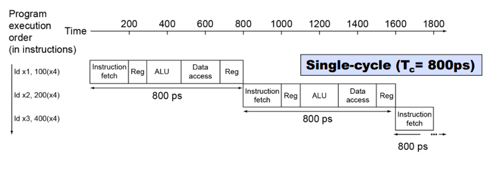
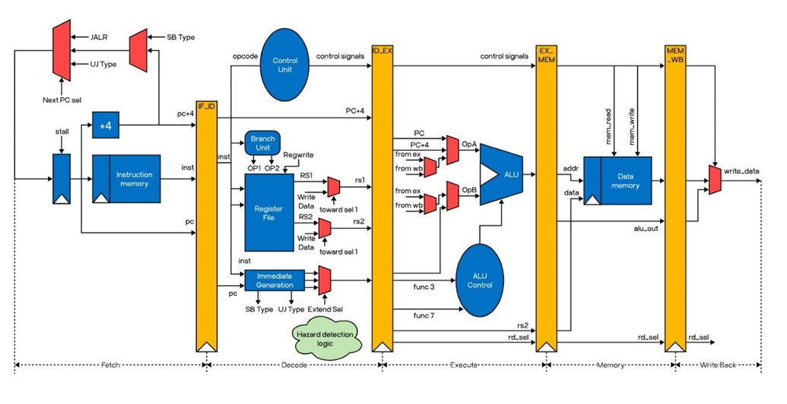
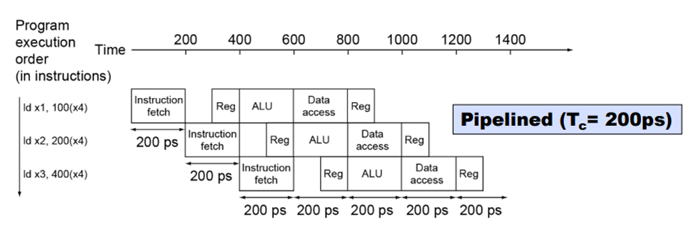
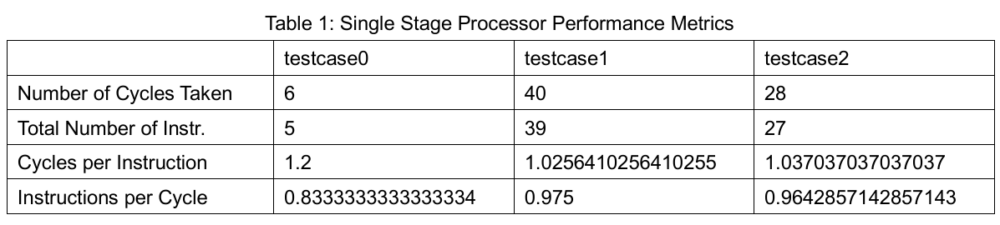
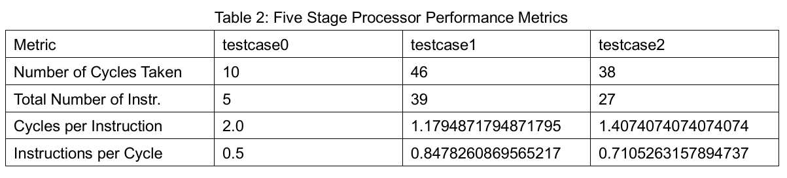

# RISC-V processor
Simulation of RISC-V single stage and five stage processors.
Single Stage Processor simulator is in single.py, and Five Stage Processor simulator is in five.py file. Execute from main.py file to run and display performance metrics of both processors with testcases. 

# single-stage processor

The data path of a single-stage processor

The execution pipeline for a single-stage processor

# five-stage processor

The data path of a five-stage processor

The execution pipeline for a five-stage processor

# Results

# Comparison
* Single stage has fewer cycles per instruction due to the absence of pipeline overhead. 
* Single stage executes more instructions per cycle since all instructions are completed before moving to the next. 
* Five-stage pipelining improves throughput with more instructions due to concurrent execution stages. 
