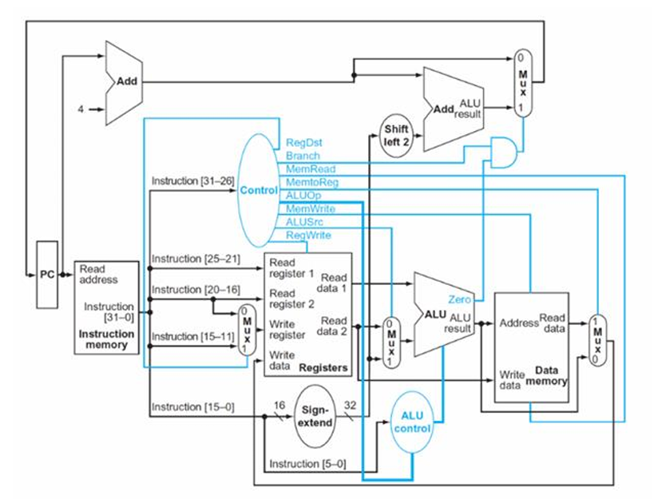

# riscv-processor
Simulation of RISC-V single stage and five stage processors.
Single Stage Processor simulator is in single.py, and Five Stage Processor simulator is in five.py file. Execute from main.py file to run and display performance metrics of both processors with testcases. 

# single stage processor

The data path of a single stage processor

The execution pipeline for a single stage processor
